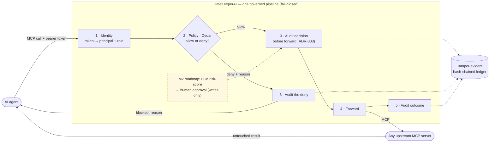
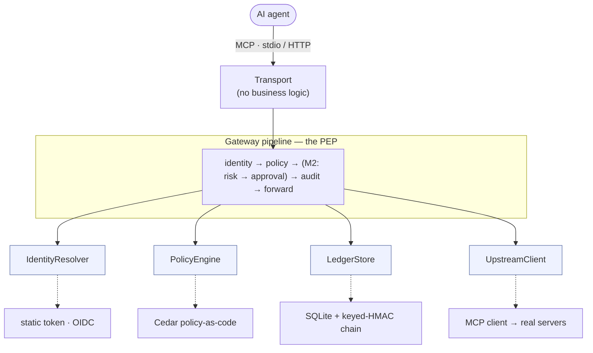

# GateKeeperAI

**A tool-agnostic, *verifiable* governance gateway for the Model Context Protocol (MCP).**

GateKeeperAI sits between an AI agent and the MCP servers it calls. Every tool call is
**authenticated**, **RBAC-checked**, **approved-on-write**, and recorded in a **tamper-evident,
hash-chained audit ledger** — for *any* MCP server you plug in by config.

> Most MCP gateways treat governance as routing ("forward the call, check a token, log it").
> GateKeeperAI's wedge is **verifiable governance**: *provable policy* (Cedar, analyzable) +
> *provable audit* (keyed-HMAC hash-chain). **Don't trust the gateway — verify it.**

---

## Why

The MCP standard says nothing about authn, authz, write-safety, or audit. As agents move from demos to
production — performing real **writes** on real systems — that gap is the blocker. GateKeeperAI closes it
with one config-driven control plane, so a platform/security engineer can adopt agents without losing
control or failing an audit.

## How it works



- **Authenticated** — every call resolves to a principal + role (`IdentityResolver`).
- **Authorized** — allow/deny per role × tool as **policy-as-code** (Cedar `.cedar` files).
- **Approved-on-write (M2)** — an LLM risk-scores calls; risky/write calls wait for a human.
- **Provably logged** — append-only, keyed-HMAC hash-chained ledger; `gatekeeper verify` proves
  no record was altered, inserted, or removed.
- **Tool-agnostic** — govern any MCP server by editing `config/upstreams.yaml`. Zero code per server.

### Architecture at a glance

Ports-&-adapters (hexagonal): the pipeline is the policy-enforcement core; every external is an
interface with a config-selected adapter, and dependencies point **inward**. (Full ADRs in
[`PRODUCT.md`](PRODUCT.md#architecture).)



## See it in 30 seconds

To **watch** governance happen — without wiring up an agent — run the narrated demo. It plays the
whole story on your terminal against the real pipeline and a real upstream subprocess (hermetic:
an ephemeral key + a throwaway ledger in a temp dir, removed on exit — nothing to set up, nothing
touched):

```bash
make demo            # or: python -m scripts.demo
```

You'll see an operator's read **allowed**, a read-only user's write **denied by Cedar policy**, a
real third-party server (`mcp-server-time`) governed with zero code, the hash-chained audit ledger
**verify clean**, and then a deliberate tamper **caught** — the wedge: *don't trust the gateway,
verify it.*

## Quickstart

GateKeeperAI is a **stdio MCP server your agent connects to**. The repo ships with a working demo
target (`config/upstreams.yaml` → a local `demo_file_server`), so you can try governance end-to-end
with no extra setup.

```bash
make install        # deps + git hooks
cp .env.example .env # then set two values in .env (see below)
make migrate        # create the tamper-evident audit ledger
make serve          # run the gateway as a stdio MCP server (waits for a client to connect)
```

Set these in `.env` (neither is an external API key):

| Variable | Value | What it's for |
|---|---|---|
| `GATEKEEPER_HMAC_KEY` | output of `openssl rand -hex 32` | local key for the ledger hash-chain (required to boot) |
| `GATEKEEPER_AGENT_TOKEN` | `dev-token-alice-REPLACE-ME` (a dev token from `config/identities.yaml`) | identifies the connecting agent; unknown/unset → refused |

Point your MCP client/agent at the `gatekeeper serve` command (the same way you'd register any stdio
MCP server). It sees the upstream's tools, and **every call is authenticated, decided, and recorded
before being forwarded**. Then, in any shell:

```bash
gatekeeper seed-demo               # prepare the demo sandbox + print a ready-to-run recipe
make tail                          # view the audit trail
make verify                        # prove the ledger is intact (exit 0 = untampered)
gatekeeper show <call_id>          # inspect the recorded decision for one call
```

### Govern any server by config (zero code)

The repo ships a **second, real upstream** to prove the tool-agnostic promise: `config/upstreams.yaml`
registers the third-party `mcp-server-time` server (which GateKeeperAI did **not** write). Install it
and it's governed exactly like the demo files — no gateway code:

```bash
pip install -e ".[demo]"           # adds the real third-party MCP server (mcp-server-time)
```

To govern *your own* MCP server, add a block to `config/upstreams.yaml` (name, transport, command) —
that's the entire integration. One unavailable upstream is logged and skipped, never fatal.

**Servers that need a credential** (e.g. a GitHub server's token) reference it by **name**, so the
secret value stays in `.env` and never lands in YAML — fail-closed if it's unset:

```yaml
  - name: github
    transport: stdio
    command: ["npx", "-y", "@modelcontextprotocol/server-github"]
    env:
      GITHUB_TOKEN: { from_env: GITHUB_TOKEN }   # value read from .env at launch, not stored here
    reads:  ["search_repositories", "get_file_contents", "list_issues"]
    writes: ["create_issue", "merge_pull_request", "delete_branch"]
```

> **Not an external service:** `serve` runs entirely local (gateway → local upstreams). No network
> call leaves your machine and no LLM/API key is involved in M1 — that arrives with M2 risk-scoring.

## Status

Early build — see [`PRODUCT.md`](PRODUCT.md) for the full vision, scope, plan, and architecture
(ADRs included), and [`STRUCTURE.md`](STRUCTURE.md) for the codebase map.

**Plain-English guides (no code):** [How it works](docs/HOW-IT-WORKS.md) (the local "guard" story) ·
[GateKeeper on Azure](docs/SHOWCASE-AZURE.md) (the hosted/enterprise story + a "what to show a customer" demo script).

| Milestone | Scope | State |
|---|---|---|
| **M1** | governed verifiable proxy (identity · RBAC · hash-chain ledger · `verify` · config-driven) | ✅ **complete** — M1.1–M1.4 shipped, `/dev-check` passed, evaluated (coverage 100% / 0 bypass) |
| **M3** | enterprise deployment readiness (HTTP transport · OIDC identity · container + Azure · observability · connector runbook) | ✅ **built + evaluated** — pulled in on fired enterprise-requirements triggers. 3 live-cloud proofs (real Entra token · Azure run · credentialed connector) are operator actions; copy-paste guides shipped |
| **M2** | LLM risk-scoring + human write-approval | planned — deliberately time-boxed (~2026-08-08) |

## License

Apache-2.0. See [`LICENSE`](LICENSE). Security policy: [`SECURITY.md`](SECURITY.md).
