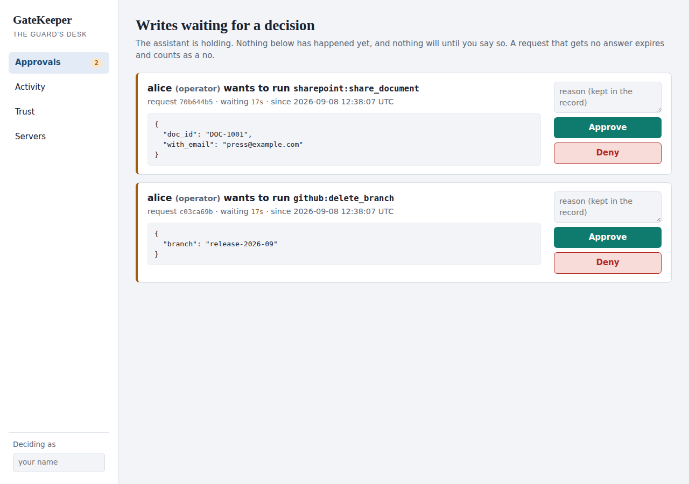

# GateKeeperAI

**A security guard between your AI agent and the tools it uses.** Every tool call is checked for
who is asking, checked against a rulebook, written to a tamper-evident audit trail, and only then
let through. It works with any server that speaks the Model Context Protocol (MCP), and you add a
server by editing a settings file, not by writing code.

## Why you would want this

When an AI assistant can read files, open tickets, or change records, three questions come up fast:

| Question | Without GateKeeper | With GateKeeper |
|---|---|---|
| Who is the AI acting as? | A shared password nobody can trace | Every call carries an identity and a role, recorded on every line |
| What is it allowed to do? | Whatever it can be talked into | A readable rulebook that reads the arguments — not `main`, not the customers table, not an outside address |
| Who said yes? | Someone's name typed into a box | A person who signed in, who is not the person who asked, recorded with how they proved it |
| What did it actually do? | A log file anyone could edit | A hash-chained ledger you can *prove* was never altered |

The last row is the point. You do not have to trust the gateway. You can check it.

**See it decided in a browser:** [The company demo](docs/DEMO-COMPANY.md) puts one assistant in
front of mail, Jira, a customer database, SharePoint and GitHub, with every write stopping at
**the desk** for a named person to approve or deny. [One afternoon with GateKeeper](docs/WALKTHROUGH.md)
is the same story from a terminal.



## See it in one command

```bash
make install && make demo
```

Nothing to configure. It uses a throwaway ledger in a temp folder and cleans up after itself.
This is the real thing, cut down to the lines that matter:

```text
Beat 1/5 - Transparent
  ALLOW  alice (operator)   demo-files:read_file
           relayed from the real server -> "Hello from GateKeeperAI ..."

Beat 2/5 - RBAC bites
  DENY   bob (read-only)    demo-files:write_file
           policy: denied by cedar policy: role 'readonly' may not write demo-files::write_file
           sandbox now contains -> welcome.txt  (secret.txt was never created - deny had no effect)

Beat 3/5 - Tool-agnostic
  ALLOW  alice (operator)   time:get_current_time
           relayed from a server we did NOT write -> {"timezone": "UTC", "datetime": ...}

Beat 4/5 - Provable audit
| seq | principal | role     | tool                  | action | verdict |
| 1   | alice     | operator | demo-files:read_file  | read   | allow   |
| 3   | bob       | readonly | demo-files:write_file | write  | deny    |
| 6   | alice     | operator | time:get_current_time | read   | allow   |
  verify -> OK  chain intact, 7 entries verified

Beat 5/5 - Don't trust - verify
  tampering with seq=3: rewriting its 'reason' to look benign...
  verify -> TAMPERED  broken at seq=3: entry_hash mismatch (record altered or wrong key)
```

## Use it for real

Three commands take a fresh checkout to a gateway your MCP host can launch:

```bash
gatekeeper init      # generates the secrets into .env, creates the ledger, seeds the demo files
gatekeeper doctor    # checks everything, then prints the block to paste into your MCP host
```

`doctor` prints something like this. Paste it into Claude Desktop's `claude_desktop_config.json`
(or any host's `mcpServers` block). The paths are absolute, so it works from anywhere:

```json
{
  "mcpServers": {
    "gatekeeper": {
      "command": "/home/you/gatekeeper/.venv/bin/gatekeeper",
      "args": ["serve"],
      "env": { "GATEKEEPER_CONFIG_DIR": "/home/you/gatekeeper/config" }
    }
  }
}
```

From then on the host launches the gateway, the gateway launches the governed servers, and every
call goes through the guard. Reads pass. A write waits for you at the desk:

```bash
gatekeeper ui                 # http://127.0.0.1:8770/ui — approvals, activity, trust, servers
```

or from a terminal:

```bash
gatekeeper pending            # writes waiting for a human, with what they want to change
gatekeeper approve <id>       # recorded under your name, then carried out
gatekeeper deny <id> --reason "not yet"   # recorded, never carried out
```

Look at what happened whenever you like:

```bash
gatekeeper tail --with-id     # the audit trail
gatekeeper show <id>          # one call: who, what, each decision, the outcome
gatekeeper verify             # exit 0 = untampered; prints a head hash you can pin
gatekeeper export --format cef --since 2026-01-01   # hand it to your SIEM
```

No assistant installed yet? `python -m scripts.agent read_file path=welcome.txt` makes one call
through the real gateway the way an assistant would.

Full walkthrough, including what each file means: [Getting started](docs/getting-started.md).

## Govern your own server

The repository ships governed by default: a file server, a third-party time server, and demo
twins of SharePoint, Jira, GitHub, a database and a mailbox with the same tool names as the real
servers. To add a real one, add a block to `config/upstreams.yaml`. That is the whole integration:

```yaml
  - name: github
    transport: stdio
    command: ["npx", "-y", "@modelcontextprotocol/server-github"]
    env:
      GITHUB_TOKEN: { from_env: GITHUB_TOKEN }   # the value stays in .env, never here
    reads:  ["search_repositories", "get_file_contents", "list_issues"]
    writes: ["create_issue", "merge_pull_request", "delete_branch"]
```

The existing rulebook already applies: a read-only role calling `create_issue` is denied, an
operator is allowed, and both are recorded. Governed servers receive only the environment they
need to start plus what you declare for them, never the gateway's own secrets.

## Run it in Docker, on your machine

The hosted shape in miniature — the gateway, a PostgreSQL audit ledger, and the desk:

```bash
docker compose up --build          # then open http://127.0.0.1:8765/ui
```

The desk asks for a token once. `local-desk-token` lets you look; `dev-token-priya-REPLACE-ME` is
priya's own — she holds the `approver` role, so she is the one who can release a held write.
Anyone else is refused, including alice, who asked for it.

Because the ledger is in the database rather than the container, `docker compose restart gateway`
leaves every record where it was, and `docker compose up --scale gateway=2` runs two gateways on
one hash chain.

## Run it for a whole team

The same gateway runs as a container over HTTPS, with your corporate login (OIDC: Entra ID, Okta,
Google) deciding each caller's role. Everything a hosted deployment differs on is an environment
variable, so you never rebuild the image to change a hostname or switch identity providers.

The audit trail lives in a managed Postgres database, so it survives the container being replaced
and more than one replica can serve at once — appends serialize on a database lock, so the chain
stays single and verifiable.

```bash
az login && bash scripts/deploy_azure.sh     # Azure Container Apps, one command, safe to re-run
```

Never done this before? [Your first deployment](docs/deploy/first-deployment.md) walks the whole
thing end to end in plain English, with the reason for every step. The settings reference is
[Deploy to Azure](docs/deploy/azure-container-apps.md).

## What works today

| Capability | Status |
|---|---|
| Every call authenticated, policy-checked, recorded before it is forwarded | Works today |
| Rules that read the arguments: not `main`, not the customers table, not an outside address | Works today |
| Writes held for a **verified** human — four-eyes, approver roles, and how they signed in is recorded | Works today |
| Held writes announced to Slack or Teams, with a link to the desk | Works today |
| Risk scoring, so only the writes that deserve a person stop at the desk | Works today |
| A web desk for approvals, activity, the integrity check and the governed servers | Works today |
| Mail, Jira, database, SharePoint and GitHub governed in one demo, real servers one config block away | Works today (demo twins) |
| Tamper-evident ledger; `verify` pinpoints any altered, inserted, or removed record | Works today |
| **Durable hosted ledger on Postgres, safe with more than one replica** | Works today |
| Export to a SIEM, retention under a signed checkpoint, chain-key rotation | Works today |
| Any MCP server governed by config alone, credentials referenced by name | Works today |
| HTTP transport, OIDC login, container image, `/metrics`, deny-spike alerts | Works today |
| One-command Azure deploy: Postgres ledger, the desk, per-deployment tokens | Works today |
| An LLM risk classifier alongside the deterministic one | Not built; the seam is open, see [risk scoring](docs/features/risk-scoring.md) |

## Learn more

- [The company demo](docs/DEMO-COMPANY.md) for a room, [One afternoon with GateKeeper](docs/WALKTHROUGH.md) for a terminal, [the use case as a story](docs/USE-CASE-STORY.md) for anyone
- [How it works](docs/HOW-IT-WORKS.md) in plain English, and [GateKeeper on Azure](docs/SHOWCASE-AZURE.md)
- [Glossary](docs/glossary.md), [feature docs](docs/features/), [codebase map](STRUCTURE.md)
- Design history and decision records: [docs/internal/PRODUCT.md](docs/internal/PRODUCT.md)

Apache-2.0. See [`LICENSE`](LICENSE) and [`SECURITY.md`](SECURITY.md).
