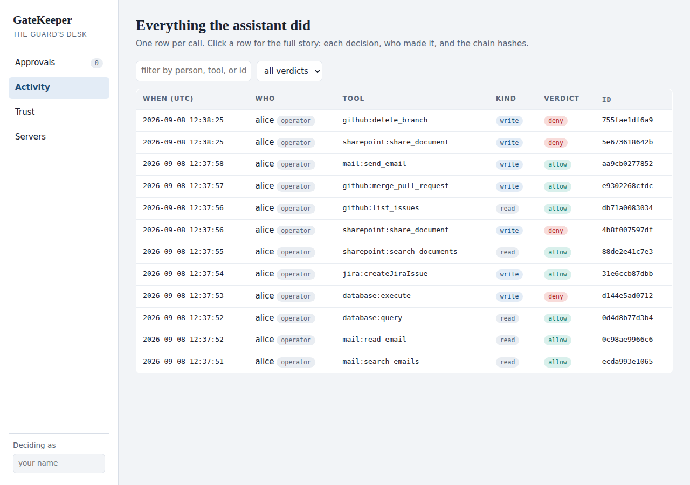
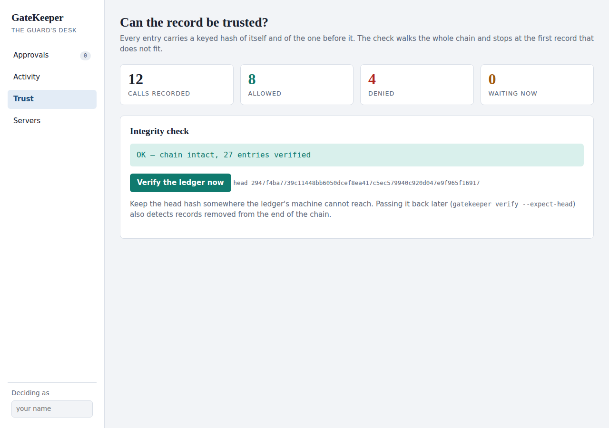
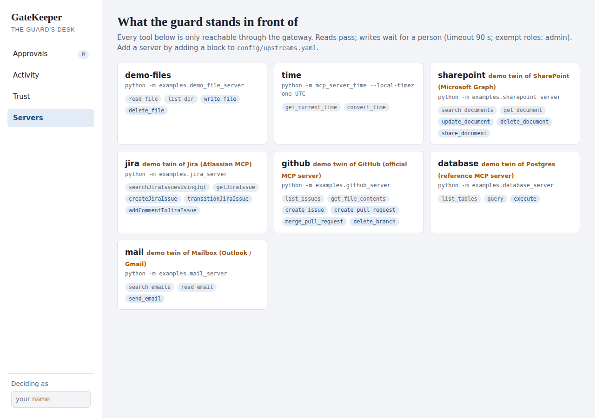

# The company demo

*Twelve minutes. One assistant, five company systems, every action through the guard, decided
by a person in a browser. Everything below is real: the transcript is from a run on 2026-09-08
and the screenshots are of the actual desk.*

## What the room will see

An AI assistant works a support request the way one would at Northwind. It reads a customer's
email, looks her up in the customer database, tries to change her record, opens a Jira ticket,
finds a contract in SharePoint, tries to share it externally, checks the payments repository on
GitHub, tries to merge a pull request, and emails the customer back.

Five systems. Ten actions. The reads happen instantly. Every write stops and appears on **the
desk**, a web page where a named person approves or denies it with a reason. Two of the five
writes get denied. At the end, one click proves that the record of all of it has not been
altered.

The five systems are demo twins: local servers with the same tool names as the real SharePoint,
Jira, GitHub, database and mailbox servers, holding a little made-up data. Say so. The point is
that the gateway does not know or care which; connecting the real one is a config block and a
credential, and the room can see that on the Servers page.

## Before the meeting

```bash
make install && source .venv/bin/activate
gatekeeper init
gatekeeper doctor            # every row OK, including the five company servers
```

Open two terminals and a browser.

| Terminal 1 | Terminal 2 | Browser |
|---|---|---|
| `gatekeeper ui` | (wait) | http://127.0.0.1:8770/ui. On your own machine the desk asks who is deciding; on a shared one you sign in and it knows |

Rehearse once with `python -m scripts.demo_company --auto`, which decides the writes itself
using the script below. Then `rm -rf .gatekeeper && gatekeeper init` for a clean ledger.

## The script

Terminal 2: `python -m scripts.demo_company`. It narrates each step and waits at every write.
Keep the browser on **Approvals**; it refreshes on its own.

**Beats 1 to 3, reads.** Say: "The assistant reads a customer's email, then looks her up in the
database. Reads never wait. But notice: nothing here was possible without going through the
guard, and every one of these is already in the record."

```text
1/10 · mail      assistant -> search_emails {"query": "address"}
                 gateway   <- M-501  amara@example.com   Please update my address
2/10 · mail      assistant -> read_email {"message_id": "M-501"}
3/10 · database  assistant -> query {"sql": "select id, name, email, tier from customers where id = 4471"}
```

**Beat 4, the first write.** The assistant tries to update the customer record. The terminal
says "held for a decision at the desk" and a card appears in the browser.


Say: "This is the moment. The assistant wants to change production data. It has stopped. Here
is who is asking, what would change, and how long it has been waiting. Nothing has happened
yet." Type a reason, *verify the customer's identity first*, and click **Deny**. Back in the
terminal:

```text
4/10 · database  assistant -> execute {"sql": "update customers set email = ... where id = 4471"}
                 held for a decision at the desk...
                 gateway   <- denied: denied by priya (request 2996fb30): verify the customer's identity first
```

Say: "The assistant was told no, with the reason, and it can tell the person who asked. The
database was never touched."

**Beat 5.** It opens a ticket instead. Approve it. "A ticket is the right move. Approved, under
my name."

**Beats 6 and 7, SharePoint.** It finds the Contoso contract, then tries to share it with an
outside address. Deny: *external sharing of legal documents needs Legal's sign-off*. Say: "This
is the one that keeps people up at night. Data leaving the company. It never left."

**Beats 8 and 9, GitHub.** It lists open issues, then tries to merge a pull request. Approve it
with the note *reviewed by the payments team this morning*. Say: "A merge changes production
code. Someone accountable said yes, and their name is on it."

**Beat 10, mail.** It replies to the customer. Approve. "An email cannot be un-sent, so it waits
too."

## Then show the record

Click **Activity**.



Say: "Every action, in order, who, which system, read or write, and the outcome. Click one."
Click the denied database write. The row opens to show the hold, then the denial with the approver's name
and reason, then the chain hashes.

Click **Trust**.



Say: "This is the part no log file gives you. Each record carries a keyed hash of itself and of
the one before it. If anyone edits, inserts, or deletes a record, the check stops at the exact
spot. You do not have to trust us. You can check."

Click **Servers** last.



Say: "This is everything the assistant can reach, and only through the guard. Adding a system
is one block in a settings file. These five are demo twins; the real SharePoint or Jira server
goes in the same slot with the company's credential, and nothing else changes."

## Questions you will get

**"Does this see everything our people say to the AI?"** No. It sees what the AI does to your
systems: which tool, on whose behalf, with what outcome. It does not see the conversation.

**"SharePoint already has permissions."** SharePoint decides what a person may do. The
assistant acts with that person's permissions, so SharePoint will let it delete anything the
person could, instantly, without knowing an AI initiated it. The guard holds the individual AI
action before it happens, across every system, and keeps one record nobody can quietly edit.

**"Who approves?"** Anyone you give the desk to. On a laptop it is open to whoever sits there.
Hosted for a team, it is behind a token today and behind your corporate sign-in for the gateway
itself. Approvals record the approver's name and reason.

**"What if nobody is there to approve?"** The request expires after the timeout, ninety
seconds by default, and that counts as a no. Nothing runs unattended.

**"Does the assistant need to change?"** No. It connects to the gateway the way it connects to
any tool server. The tools it sees are the same tools; the guard is invisible when you are
allowed.

**"What is not built yet?"** Deciding automatically which writes are low-risk enough to skip
the person. Today every write by an operator waits. Also the hosted audit ledger is not yet
durable across a container restart; the deploy guide says so.

## Reset between runs

```bash
rm -rf .gatekeeper && gatekeeper init
```

The demo twins keep their data only while the gateway runs, so every run starts from the same
inbox, tickets, documents and repository.
