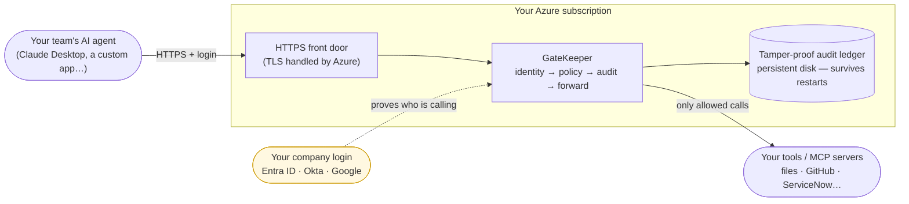

# GateKeeper on Azure — explained, and how to show it to a customer

*Plain-English guide for a non-technical reader (a founder, seller, or buyer) **and** for anyone who
needs to demo the enterprise version on a call. The local-laptop version is explained in
[HOW-IT-WORKS.md](HOW-IT-WORKS.md); this page is the **hosted, enterprise** story.*

---

## In one line

**GateKeeper is the security guard between your AI agents and your tools. The Azure version is that same
guard, running as a hosted service your whole company can use — with your real corporate logins, a live
health dashboard, and a tamper-proof audit trail — on your own Azure.**

It's for the **platform / security engineer** who has to let AI agents act on real systems (files, GitHub,
databases, ticketing) *without* losing control or failing an audit.

---

## From a laptop to the enterprise (what actually changes)

In the local demo you saw the guard running on one machine. The enterprise version is the **same guard,
same checks** — just packaged so a whole organisation can rely on it:

| | On a laptop (what you've seen) | On Azure (the enterprise version) |
|---|---|---|
| **Where it runs** | the same machine as the AI assistant | hosted on **your Azure**, reachable by your whole team |
| **How agents reach it** | a local pipe (stdio) | a secure **web address (HTTPS)** |
| **Who's calling** | hand-made dev badges (tokens) | **real corporate logins** — Microsoft Entra ID (Azure AD), Okta, Google |
| **The audit trail** | tamper-proof logbook (a local file) | tamper-proof logbook on a **persistent Azure disk** (survives restarts) |
| **Health & monitoring** | check it from the command line | a live **`/metrics`** feed for Grafana / Azure Monitor, plus alerts |
| **Adding a new tool** | edit one settings file | the same — **config + a secret, no code** |

Nothing about the *governance* changes — every call is still authenticated, policy-checked, and recorded
before it's allowed through. Azure just makes the guard **shared, always-on, and tied to your real identity
system**.

---

## The picture

Read it left to right: an agent makes a request over HTTPS → Azure terminates the encryption → GateKeeper
checks the caller's **real login**, applies your **policy**, writes a **tamper-proof audit record**, and only
then forwards the call to the actual tool. A denied or tampered call is caught and recorded.

---

## Why a customer cares

- **Agents now do real writes.** The moment an AI can create a ticket, merge a PR, or change a database, a
  wrong or hijacked call has real blast radius. GateKeeper makes every write **authorised and recorded** —
  and (next milestone) **human-approved**.
- **Audits need proof, not logs.** Plain logs can be edited. GateKeeper's audit trail is **hash-chained**, so
  you can *prove* no record was altered or removed — the wedge: *"don't trust the gateway, verify it."* That's
  what stands up to SOC2 / HIPAA / GDPR review.
- **Regulation is landing now.** The high-risk provisions of the EU AI Act demand structured audit trails and
  human oversight of automated actions. GateKeeper is built around exactly that.
- **One control plane for any tool.** Govern *any* MCP server — yours or a third party's — by config alone.
  No rebuilding auth/audit into every integration.

---

## What to show on a call — the demo script

A short, repeatable tour. Each beat is **what you do · what you say · what they see**. The story is identical
whether you run it locally or against the hosted Azure gateway — only the address changes.

> **Two one-command demos run the whole story locally, no setup:**
> `make demo` (the local stdio story) and **`make demo-enterprise`** (the hosted shape — governed over
> **HTTP** with a **real login / OIDC**, a local fake IdP standing in for Entra/Okta). Both are hermetic
> (throwaway ledger, removed on exit).

> **Availability today** is marked on each beat:
> 🟢 **runs now** via `make demo` (local stdio) · 🔵 **runs now** via `make demo-enterprise` (HTTP + real
> login/OIDC, local) · 🟣 **needs the live Azure URL** (one-time deploy — see the honesty note below).

**Beat 1 — A normal request goes through, and is recorded. 🟢🟣**
- *Do:* point an AI agent at the gateway and have it **read** something (a file, an issue).
- *Say:* "The agent didn't talk to the tool directly — it went through GateKeeper, which checked who it was
  and logged it before letting it through."
- *See:* the correct result comes back normally, and a new line appears in the audit trail (`gatekeeper tail`).

**Beat 2 — A request that breaks the rules is blocked, with a reason. 🟢🟣**
- *Do:* switch to a **read-only** user and have the agent try to **write** (e.g. delete a branch, create a file).
- *Say:* "Same agent, different role. Read-only isn't allowed to write — so the guard blocks it and records
  *why*. The tool was never touched."
- *See:* a clear `denied: role 'readonly' may not write …` and a recorded deny in the trail.

**Beat 3 — Prove the audit trail can't be faked. 🟢🟣 (the wedge)**
- *Do:* run `gatekeeper verify` (→ "OK ledger intact"), then **tamper** with one past record and run `verify`
  again.
- *Say:* "Anyone can claim they logged everything. GateKeeper lets you *prove* it. Watch — I'll secretly edit
  one record…"
- *See:* `verify` now fails and **points at the exact entry**: `TAMPERED broken at seq=2`. The forgery can't hide.

**Beat 4 — Govern a new tool with zero code. 🟢🟣**
- *Do:* show a real third-party tool (the `time` server, or a GitHub server) being governed — added by a few
  lines of config, no code.
- *Say:* "We didn't write any code for this tool. We listed it in a settings file and it's now fully governed —
  authenticated, policy-checked, audited."
- *See:* the tool's actions flow through the same allow/deny/audit pipeline.

**Beat 5 — Real corporate login decides the role. 🔵🟣**
- *Do:* have a user sign in with a **real company account** (Entra ID / Okta); their **group** decides their role.
- *Say:* "No hand-made tokens. The person's real corporate identity — and the group they're in — decides what
  the agent may do on their behalf. Remove them from the group and their access is gone."
- *See:* the audit trail shows the real user's identity; an unmapped or expired login is **denied, fail-closed**.

**Beat 6 — Live health. 🔵🟣**
- *Do:* open the `/metrics` page (or `gatekeeper stats`).
- *Say:* "Operations can watch this live — call volume, allow/deny rates, latency against budget — and get an
  alert the instant anyone tampers with the audit trail or denials spike."
- *See:* live numbers a standard monitoring tool (Prometheus / Grafana / Azure Monitor) reads.

**Close:** *"Same governance you'd run on a laptop, now a hosted control plane on your Azure, tied to your real
logins, with an audit trail you can prove. Don't trust the gateway — verify it."*

---

## Real vs in-progress — be straight with the customer

Honesty keeps trust. Here's exactly where things stand:

| Capability | Status |
|---|---|
| Network access over HTTPS (the hosted shape) | ✅ Built — the gateway runs over HTTP today |
| Real corporate login (OIDC: Entra / Okta / Google) | ✅ Built + tested against a test identity provider; **plugging in your real tenant is a config step** |
| Tamper-proof audit + `verify` | ✅ Built — the core wedge, proven |
| Govern any tool by config (incl. credentialed) | ✅ Built — proven with a real third-party server |
| Live `/metrics` + alerts | ✅ Built |
| **Actually deployed on a live Azure subscription** | ⏳ **Not yet run live** — the deploy is a **copy-paste guide** ([azure-container-apps.md](deploy/azure-container-apps.md)) and the container is proven locally; standing it up on your Azure is a one-time ~15-minute step |
| Human approval of risky writes | 🔜 Next milestone (M2) |

**The one thing to do before a *live-on-Azure* customer demo:** run the deploy once on your subscription
(the guide is ready). Until then, the same story demos perfectly on a laptop — the customer sees the identical
behaviour; only the address is `localhost` instead of an Azure URL.

---

## For the engineer in the room

The technical detail behind each beat:

- **HTTPS / network transport** → [features/http-transport.md](features/http-transport.md)
- **Real login (OIDC), incl. Entra setup** → [features/oidc-identity.md](features/oidc-identity.md)
- **Deploy to Azure (step-by-step `az` commands)** → [deploy/azure-container-apps.md](deploy/azure-container-apps.md)
- **The container image** → [features/container-deploy.md](features/container-deploy.md)
- **Live metrics & alerts** → [features/observability.md](features/observability.md)
- **Onboarding a new credentialed tool** → [runbooks/connector-onboarding.md](runbooks/connector-onboarding.md)
- **The whole why/what/how** → [../PRODUCT.md](../PRODUCT.md)
