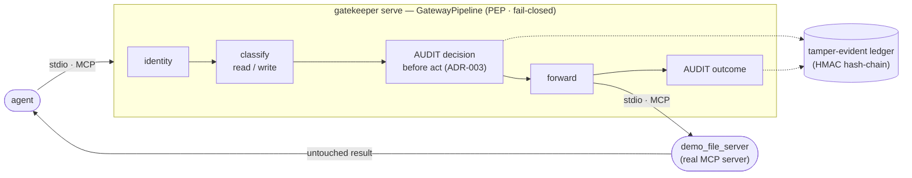

# Feature: Transparent governed MCP proxy (M1.1)

**Status:** built · live-verified · documented. The decision point the whole product layers on.

## What it does
A transparent man-in-the-middle MCP proxy. An agent connects to `gatekeeper serve` (stdio) exactly as
if it were the real server; the gateway re-exposes every registered upstream's tools **under their
original names**, and routes each call through the governance pipeline before forwarding it to the
real upstream and relaying the untouched result back. Every call is recorded in the tamper-evident
ledger built in M1 — so this slice is what actually *feeds the wedge*.

## Contract (in/out)
- **Pipeline (PEP):** `gateway.pipeline.GatewayPipeline.handle(token, upstream, tool, arguments, call_id)`
  → `schemas.models.ToolResult`. Raises `domain.errors.IdentityError` on an unknown token (after auditing
  the deny). SDK-free: speaks only typed DTOs + ports, so it is unit-testable with fakes.
- **Ports used:** `IdentityResolver.resolve` · `LedgerStore.append` · `UpstreamClient.forward` (async).
- **Adapters added:** `adapters.identity.static_token.StaticTokenResolver` (token→Principal, fail-closed) ·
  `adapters.upstream.mcp_client.McpUpstreamClient` (persistent MCP-client sessions per upstream).
- **Transport:** `transport.stdio_server.serve_stdio` (low-level MCP `Server`) → CLI `gatekeeper serve`.
- **Composition:** `gateway.factory.build_runtime()` wires adapters from config (no hardcoding).
- **Classification:** `domain.classify.ActionClassifier` — config-driven read/write (annotation wins,
  then `write_detection.name_patterns`), enriches the audit + gates M2.

## Definition of done — incl. security (met)
- [x] **No ungoverned bypass path.** The only side effect (`upstream.forward`) lives *inside*
      `handle`, after identity + an audit append. A call cannot be forwarded without first being
      governed and recorded.
- [x] **Audit-before-act, fail-closed (ADR-003).** The decision entry is appended **before** the
      forward; if that append raises, the forward never happens. Proven by `test_ledger_append_failure_blocks_forward`
      and `test_audit_store_failure_blocks_the_forward` (`spy.calls == []`).
- [x] **Fail-closed identity.** Unknown/empty token → deny is **recorded** (principal `<unauthenticated>`)
      then raised; never forwarded. `serve` refuses to start on an unauthenticated agent token (exit 2).
      The token value is never echoed in errors/logs.
- [x] **Every call reaches the audit layer.** The transport sets `validate_input=False` so even a
      schema-invalid call is audited (the upstream still validates on forward) — no silent pre-handler drop.
- [x] **PII stance.** Raw arguments are never stored (only a keyed `payload_hash`); a successful
      result's `result_summary` is **status-only metadata** (`ok: N block(s), M chars`), never the
      output body — the real output is relayed live to the agent via `ToolResult.raw` (`exclude=True`,
      so it can never serialize into a log or the chain).
- [x] **No secret in code** (tests use `"k"*64`; identities are `*-REPLACE-ME` fakes, gitleaks-allowlisted).
- [x] **Single-responsibility kept** — transport / pipeline / adapters / classifier / composition each
      isolated; the pipeline is the only orchestrator and is SDK-free.

## How it was verified (evidence)
- **LIVE path (real CLI, real subprocess upstream):** `gatekeeper serve` driven by a real MCP client →
  `list_tools` returned the 4 demo tools under original names → `write_file` then `read_file` returned
  the correct content (`live-proof`) transparently → `gatekeeper tail` showed **4 entries** (2 per call:
  decision + outcome, alice/allow) → `gatekeeper verify` = `OK ledger intact - 4 entries verified`
  (exit 0). Fail-closed proven live: unknown agent token → exit 2; missing HMAC key → exit 2.
- **Tests (58 total; 28 new):** unit — `test_classify`, `test_identity`, `test_payload_hash`,
  `test_summarize`, `test_pipeline` (audit-before-forward ordering, deny-audited-not-forwarded,
  append-failure-blocks-forward, payload-hash/PII). Integration — `test_proxy` (real `demo_file_server`
  subprocess + real ledger: transparent relay, 2-entries-per-call, `verify` ok, classification, no
  plaintext in the ledger). Adversarial — `test_proxy_governance` (unauthenticated denied+recorded+not
  forwarded, audit-store failure blocks forward, tampering a recorded result breaks `verify`).
- **Reviews:** `/code-review` (high) → 6 real findings fixed (see below). `/security-review` → **no
  findings ≥ conf 8**; invariants traced end-to-end.
- **Static:** ruff + ruff-format + mypy (strict) all clean across 48 source files.

## Review findings fixed (this slice)
1. **Concurrent session-open race** — the MCP server dispatches requests concurrently (`tg.start_soon`);
   `McpUpstreamClient` now guards session creation with a double-checked `_create_lock` and pre-creates
   per-upstream call locks in `__init__` (no lock assigned after first use).
2. **Unaudited pre-handler rejection** — `validate_input=False` so malformed-arg calls still reach the
   pipeline and are audited.
3. **Output in the ledger** — `_summarize` is now status-only for success (was truncated-but-raw).
4. **Double boot** — `open_ledger(settings, config)` reuses the already-booted config (was a second
   config load + security-guard run on every startup).
5. **Audit drift risk** — the two `_record` calls collapsed into a per-call bound recorder so the
   decision and outcome entries can't disagree on who/what/verdict.
6. **Canonicalization single-sourced** — `_canonical_json` shared by `canonical_payload` +
   `compute_payload_hash`.

## Known limitations (honest)
- **Two entries per allowed call.** Honoring ADR-003 (audit *before* act) while also recording the
  outcome means a decision entry (committed pre-forward) **plus** an outcome entry (post-forward), both
  chained. This is stronger than the exit criterion's literal "an entry"; it is the deliberate design.
- **Post-forward audit failure.** If the *outcome* append fails after a forward already executed, the
  action happened but its outcome entry is missing and the agent gets an error (the load-bearing
  decision entry is still committed). A two-phase commit is out of scope for M1.
- **Truncation, not deep redaction.** Error summaries keep a 200-char diagnostic (which could include a
  path); successful outputs are status-only. Secret-pattern scrubbing is a future enhancement.
- **Classification defaults unmatched tools to READ.** Harmless in M1.1 (allow-all; classification only
  enriches the audit) but **annotate writes explicitly** before M2 RBAC/approval keys off `action_kind`.
- **stdio only.** HTTP transport (agent-facing + upstream) is a fast-follow within M1.
- **Per-session identity.** One bearer token per stdio session (`$GATEKEEPER_AGENT_TOKEN`); per-call
  tokens / OIDC / sender-constrained tokens arrive with M1.2 / the deferred identity work (ADR-006).

## Code
- `src/gatekeeper/gateway/pipeline.py` — the PEP (identity→classify→audit-before→forward→audit-outcome).
- `src/gatekeeper/gateway/factory.py` — `build_runtime()` composition root (adapters from config).
- `src/gatekeeper/transport/stdio_server.py` — the transparent stdio proxy server + `serve_stdio`.
- `src/gatekeeper/adapters/upstream/mcp_client.py` — `McpUpstreamClient` (persistent sessions, redaction).
- `src/gatekeeper/adapters/identity/static_token.py` — `StaticTokenResolver` (fail-closed).
- `src/gatekeeper/domain/classify.py` — `ActionClassifier` (config-driven read/write).
- `src/gatekeeper/domain/errors.py` — `IdentityError` / `UpstreamError` (fail-closed domain errors).
- `src/gatekeeper/adapters/ledger/hashchain.py` — `compute_payload_hash` + shared `_canonical_json`.
- `src/gatekeeper/cli/app.py` — `serve` command. `examples/demo_file_server.py` — the governed target.
