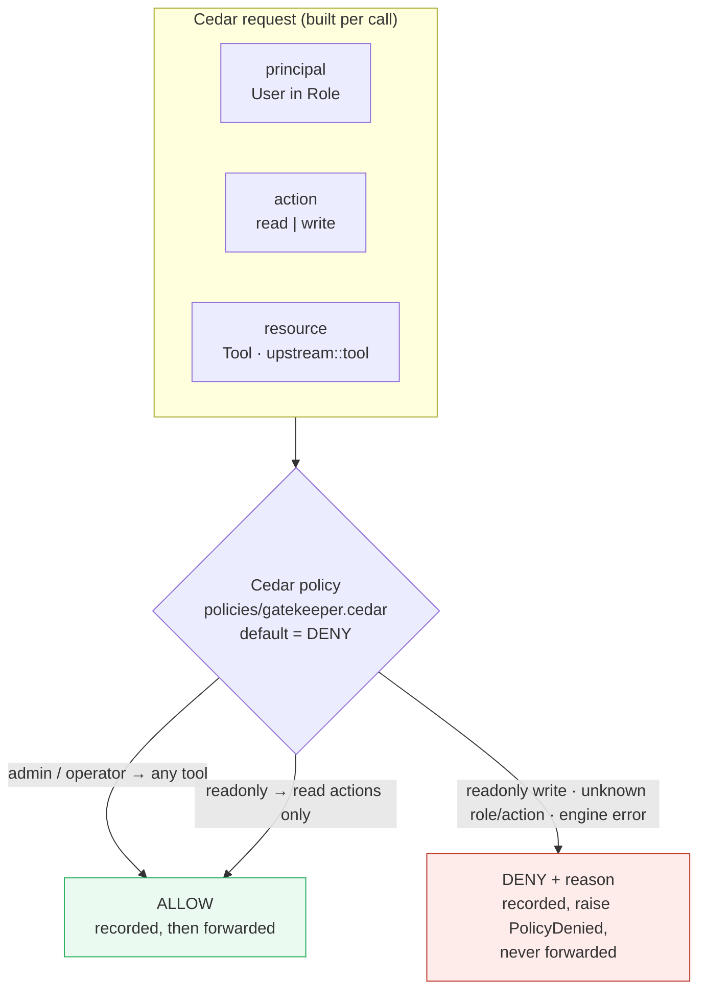

# Feature: Identity + RBAC policy-as-code — Cedar (M1.2)

**Status:** built · live-verified · code- & security-reviewed · documented. The authorization
decision point — the "authorized" leg of the wedge (*authenticated + **authorized** + provably logged*).

## What it does
Inserts a **policy decision point (PDP)** between identity and the audit ledger. A call's resolved
principal (token → `id` + `role`, from M1.1) and its classified action (`read`/`write`) are evaluated
against a **version-controlled Cedar policy** (`policies/gatekeeper.cedar`). The verdict is **allow or
deny with a human-readable reason**; a denied call is recorded and **never forwarded** (fail-closed),
an allowed call proceeds exactly as before. RBAC rules live entirely in the `.cedar` file — **zero
authorization logic is hardcoded** — so who-may-call-what is changed by editing config, not code.

## Cedar request model
Mirrors the header of `policies/gatekeeper.cedar`:
- **principal** = `User::"<id>"`, a **member of** `Role::"<role>"` (the role carries the grants).
- **action** = `Action::"read"` | `Action::"write"` (from the call's classified `action_kind`).
- **resource** = `Tool::"<upstream>::<tool>"`.

The shipped policy: `admin` → any tool; `operator` → any tool; `readonly` → **read actions only**.
Cedar's default is **deny** (nothing a `permit` doesn't match), so the engine is fail-closed by
construction — and hardened further (below).

## Contract (in/out)
- **Port:** `ports.policy.PolicyEngine.evaluate(principal, call) -> schemas.models.Decision`
  (`verdict` ∈ {allow, deny}, `reason`). Deterministic; **never raises** — any engine error is a
  fail-closed DENY (honoring the port's documented contract).
- **Adapter added:** `adapters.policy.cedar.CedarPolicyEngine` — the **only** layer that imports the
  Cedar SDK (`cedarpy`), per ports-&-adapters / ADR-004. `from_config(policy_dir)` loads + validates
  every `*.cedar` file (fail-loud); `evaluate` builds the request/entities as **structured dicts**
  (not concatenated policy text) and maps Cedar's decision → `Decision`.
- **Pipeline change:** `gateway.pipeline.GatewayPipeline.handle` now calls `policy.evaluate` (step 3,
  replacing M1.1's allow-all). On DENY it records the decision entry then raises
  `domain.errors.PolicyDenied` — the forward (step 5) is unreachable on a deny.
- **Transport:** `transport.stdio_server` catches `(IdentityError, PolicyDenied)` → returns the agent
  an `isError` result `denied: <reason>` (the call is already recorded; the token is never echoed).
- **Composition:** `gateway.factory.build_runtime` builds the engine from `platform.yaml`
  (`adapters.policy=cedar`, `policy.dir`) and injects it (no hardcoding; unsupported adapter → fail-loud).

## Definition of done — incl. security (met)
- [x] **Authorize per (role × action × tool) from config.** A `readonly` role calling a write is
      **blocked with a reason**; an allowed call passes — both recorded. The rules live only in
      `policies/gatekeeper.cedar` (version-controlled), not in source.
- [x] **Fail-closed at evaluation.** Default-deny; an unknown role → deny; Cedar `NoDecision` → deny;
      any engine exception → deny. The only ALLOW path is an explicit `CedarDecision.Allow`.
- [x] **Fail-loud at load.** A missing policy dir, an empty dir (no `.cedar`), an **unparseable**
      policy, or a syntactically-valid policy with **zero** permit/forbid statements (which would
      silently deny-all) all raise `ConfigError` — the gateway refuses to boot.
- [x] **No ungoverned bypass on deny.** The deny entry is appended to the tamper-evident ledger
      **before** `PolicyDenied` is raised; the upstream forward is strictly after that branch, so a
      denied call has **no side effect**. Proven live (the denied write never reached disk) and by
      `test_live_proxy_denies_readonly_write_without_touching_upstream`.
- [x] **No policy/entity injection.** Request principal/action/resource are passed as Cedar EUID
      *strings*, so an oddly-named upstream tool is escaped (`_escape`: backslash-before-quote) — a
      crafted name can't inject Cedar syntax or change the verdict. Entities are structured dicts.
- [x] **No secret leak.** The bearer token never reaches the policy layer; the deny reason + the
      `call denied: policy` log carry only `principal`/`role`/`upstream`/`tool`/`action`.
- [x] **Single-responsibility kept.** PDP isolated in the adapter; the pipeline stays SDK-free and
      only orchestrates; identity/classify/policy/ledger/upstream remain separate ports.

## How it was verified (evidence)
- **LIVE path (real composition root + CLI binary):** built the runtime from real `config/` +
  `policies/`, then drove the wired pipeline:
  - `bob` (readonly) `write_file` → **DENY**, reason *"role 'readonly' may not write
    demo-files::write_file (default-deny)"*, recorded as **seq 1** (a single entry), never forwarded.
  - `bob` (readonly) `list_dir` → **ALLOW** (proves the deny is RBAC, not a blanket block).
  - `alice` (operator) `write_file` → **ALLOW** (seq 4 decision + seq 5 outcome).
  - `gatekeeper tail` showed the verdicts above; `gatekeeper verify` = `OK ledger intact - 5 entries
    verified` (exit 0). `gatekeeper health` shows `policy=cedar` wired.
- **Tests (77 total; +19 over M1.1), all green:**
  - **unit** `test_policy.py` — the RBAC matrix (readonly/operator/admin × read/write), unknown-role
    deny, unknown-action deny, deny-reason content, odd-tool-name escaping, and the four fail-loud
    load guards (missing dir / empty dir / unparseable / comments-only) + fail-closed eval error.
    `test_pipeline.py` — `test_policy_deny_is_recorded_once_and_not_forwarded` (one entry, no forward).
  - **adversarial** `test_proxy_governance.py` — readonly write denied/recorded/not-forwarded against
    the **real Cedar engine + real ledger**, with `verify().ok`; readonly read allowed.
  - **integration** `test_proxy.py` — end-to-end over the **real upstream subprocess**: the denied
    write leaves no file on disk (re-read errors), `verify().ok`.
- **Reviews:** `/code-review` (high, 2 independent finder agents) → **no contract-breaking bugs**; two
  hardening items taken (the zero-statement load guard; eval-error detail in the structured log).
  `/security-review` → **no findings ≥ conf 8** (9/10, verified against the live Cedar engine: no
  authorization bypass, no injection, no fail-open, no token leak).
- **Static:** ruff + ruff-format + mypy(strict) clean across all source files.

## Known limitations (honest)
- **Authorization rides on the classifier's `action_kind`.** The PDP faithfully enforces whatever
  read/write the M1.1 `ActionClassifier` assigns. That classifier **defaults unmatched tools to READ**,
  so an *unannotated* write tool would be evaluated as a read and thus permitted for `readonly`.
  Mitigation: annotate writes explicitly per upstream (`upstreams.yaml` `writes:` — already done for
  the demo) or via `write_detection.name_patterns`. This is pre-existing M1.1 behavior, not introduced
  here; it is the seam to tighten before M2 approval keys off `action_kind`.
- **Role-level RBAC only (no per-user / per-tenant rules yet).** Principals are modeled as a `User` in
  a `Role`, so per-user or per-tenant policies are a natural extension, but the shipped policy decides
  by role and ignores `tenant` (multi-tenant is deferred per Scope).
- **No Cedar schema / validation pass.** Load-time validation is parse + non-empty-statement; semantic
  schema validation (`validate_policies` against a typed schema) is a future hardening.
- **Single bearer token per stdio session.** Per-call tokens / OIDC / sender-constrained tokens remain
  deferred identity work (ADR-006) — unchanged by this slice.

## Code
- `src/gatekeeper/adapters/policy/cedar.py` — `CedarPolicyEngine` (load+validate, evaluate, escaping).
- `policies/gatekeeper.cedar` — the version-controlled RBAC contract (admin/operator/readonly).
- `src/gatekeeper/gateway/pipeline.py` — PDP wired at step 3; deny → record → `PolicyDenied`.
- `src/gatekeeper/gateway/factory.py` — `_build_policy` (config-selected, fail-loud).
- `src/gatekeeper/domain/errors.py` — `PolicyDenied` (fail-closed domain error).
- `src/gatekeeper/transport/stdio_server.py` — surfaces `PolicyDenied` to the agent.
- `src/gatekeeper/ports/policy.py` — the `PolicyEngine` Protocol (unchanged contract).
