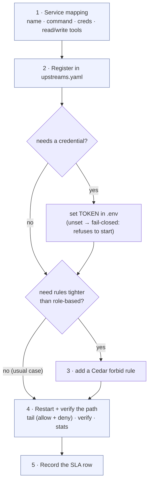

# Runbook — onboard a credentialed third-party MCP connector (M3.5)

> Audience: a **fresh operator** (no GateKeeper code knowledge). Outcome: a third-party MCP
> server — including one that needs a credential (GitHub, ServiceNow-class, Jira, …) — fully
> governed (authenticated · RBAC · tamper-evident audit) using **config + `.env` only, zero code**.
> Time budget: **< 10 minutes** (the locked north-star secondary).

## At a glance



## Prerequisites

- A running gateway (`gatekeeper serve`, any transport) or the container ([deploy guide](../deploy/azure-container-apps.md)).
- The connector's launch command (any stdio MCP server: `npx …`, `python -m …`, a binary).
- Its credential, if any (an API token / OAuth secret it expects as an environment variable).

## Step 1 — Fill in the service-mapping template (5 lines of thinking before any config)

| Field | Your answer (example: GitHub) | Why it matters |
|---|---|---|
| Logical name | `github` | becomes the upstream id in policy + every audit entry |
| Launch command | `npx -y @modelcontextprotocol/server-github` | how the gateway starts/owns the subprocess |
| Credential env var(s) | `GITHUB_TOKEN` | referenced **by name** in YAML; value only ever in `.env` |
| Read tools | `search_repositories, get_file_contents, list_issues` | RBAC: what `readonly` may call |
| Write tools | `create_issue, merge_pull_request, delete_branch` | RBAC: denied to `readonly`; **list every destructive tool here — an unannotated write whose name matches no `write_detection` pattern is classified read** (known M1 limitation; the M2 LLM classifier is the backstop) |

## Step 2 — Register it in `config/upstreams.yaml`

```yaml
  - name: github
    transport: stdio
    command: ["npx", "-y", "@modelcontextprotocol/server-github"]
    env:
      GITHUB_TOKEN: { from_env: GITHUB_TOKEN }   # NAME here; VALUE in .env (never in YAML)
    reads:  ["search_repositories", "get_file_contents", "list_issues"]
    writes: ["create_issue", "merge_pull_request", "delete_branch"]
```

Add the credential line to `.env` (your file, never committed): `GITHUB_TOKEN=ghp_…`
A referenced-but-unset secret **refuses to start with a clear error** (fail-closed) — that is the
expected signal that `.env` is incomplete, not a gateway bug.

## Step 3 — Decide who may call it (usually: nothing to do)

The committed Cedar policy ([policies/gatekeeper.cedar](../../policies/gatekeeper.cedar)) is
role-based, not per-connector: `admin`/`operator` may call any governed tool, `readonly` only
`read`-classified ones — your Step-1 read/write mapping IS the enforcement input. Only edit the
policy if this connector needs tighter rules (e.g. nobody but `admin` may call
`github::delete_branch`):

```cedar
forbid (principal, action, resource == Tool::"github::delete_branch")
unless { principal in Role::"admin" };
```

## Step 4 — Restart + verify the governed path (2 minutes)

```bash
gatekeeper serve            # restart picks up the registry change
# from your MCP host/agent: list tools (the connector's tools appear under their original
# names), make one read call, and — with a readonly token — attempt one write (expect: denied)
gatekeeper tail             # both calls recorded (allow + deny), principal + verdict + reason
gatekeeper verify           # OK ledger intact — the audit chain covers the new connector
gatekeeper stats            # the connector shows up in busiest tools
```

A connector that fails to launch (typo, missing package, bad credential) is **logged and
skipped** — its tools are simply not exposed (no ungoverned bypass) and every other connector
keeps working; check the `upstream unavailable` log line.

## Step 5 — Record the SLA row (the operations contract for this connector)

| Field | Template | Example: GitHub |
|---|---|---|
| Owner (who fixes it) | team/person | platform-eng |
| Credential rotation | where + cadence | `.env` / Container Apps secret · 90 days |
| Upstream timeout | `resilience.upstream.timeout` (global today) | 30 s |
| Failure posture | what users see when it is down | tools not exposed; calls to it impossible (fail-closed, no bypass) |
| Audit review | who reads `stats`/`tail` for it, how often | security-eng · weekly |
| Deny-spike alert | webhook armed? (`GATEKEEPER_ALERT_WEBHOOK`) | yes → #sec-alerts |

## Worked proofs

- **Zero-code, uncredentialed (proven live in CI + demo):** `mcp-server-time` — the committed
  `time` block in [config/upstreams.yaml](../../config/upstreams.yaml); governed end-to-end with
  no gateway change (M1.4 exit evidence).
- **Credentialed (this runbook's target):** the GitHub block above is ready to paste — set
  `GITHUB_TOKEN` in `.env` and run Step 4. ServiceNow-class connectors follow the identical
  shape: launch command + `{ from_env: … }` credentials + read/write mapping. *(The live
  credentialed run needs a real token, so it is the operator's 5-minute exercise — every
  mechanism it uses (secret injection, skip-on-bad-upstream, RBAC, audit) is already proven by
  live-subprocess tests: `tests/integration/test_upstream_secret_injection.py`,
  `tests/integration/test_any_server.py`, `tests/integration/test_proxy.py`.)*

## Troubleshooting

| Symptom | Cause → fix |
|---|---|
| `refusing to start: secret X referenced but not set` | add `X=…` to `.env` (this is the fail-closed design working) |
| Connector's tools missing from `tools/list` | it failed to launch — see the `upstream unavailable` log; fix command/package/credential |
| A write tool is callable by `readonly` | it isn't in `writes:` and matches no `write_detection` pattern → annotate it (Step 1's warning) |
| `verify` fails after onboarding | unrelated to onboarding — treat as tampering: `gatekeeper show <seq>` and follow the security runbook |
