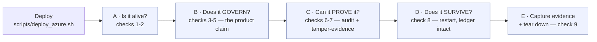

# Runbook — verify a HOSTED GateKeeper deployment (the M3.3 exit proof)

> Audience: **anyone** — no GateKeeper or Azure knowledge assumed. Outcome: evidence that a real
> deployed gateway governs real calls from the public internet and keeps a provable audit trail.
> Time budget: **~20 minutes**, plus the deploy itself. Cost: **cents**, if you tear down at the end.

This runbook is the *test plan* for [the Azure deploy guide](../deploy/azure-container-apps.md).
The deploy makes it exist; this proves it works. Nine checks, each with the exact command, what a
PASS looks like, and what to do when it fails.



## Before you start

- The deploy finished and printed a green `DEPLOYED.` line with an `https://…` URL.
- You are in the repo root in Git Bash, with the project's virtualenv available.
- Keep the deploy's output — you need the URL. If you lost it, get it back with check 0.

Two names are used throughout; change them if you overrode them at deploy time:
resource group `gatekeeper-rg`, app `gatekeeper`.

---

## Check 0 — recover the public address

```bash
az containerapp show -n gatekeeper -g gatekeeper-rg --query properties.configuration.ingress.fqdn -o tsv
```

**PASS:** prints something like `gatekeeper.politemoss-1a2b3c4d.westeurope.azurecontainerapps.io`.

Save it into a shell variable so the rest of the commands are copy-paste:

```bash
FQDN=$(az containerapp show -n gatekeeper -g gatekeeper-rg --query properties.configuration.ingress.fqdn -o tsv); echo "$FQDN"
```

---

## Part A — is it alive?

### Check 1 — the gateway answers over public HTTPS

```bash
curl -fsS "https://$FQDN/healthz"
```

**PASS:** `{"status":"ok"}`

**What it proves:** the container booted, migrations ran, the HTTP server is listening, and Azure's
ingress is terminating TLS in front of it. This is no longer a laptop.

You can also paste `https://<fqdn>/healthz` into a browser — same result, and it is worth seeing
the padlock icon: that HTTPS certificate is real and was issued automatically.

**FAIL → ** the container is crash-looping. Read the logs:
```bash
az containerapp logs show -n gatekeeper -g gatekeeper-rg --tail 50
```
The most common causes are a failed `alembic` migration or a missing `GATEKEEPER_HMAC_KEY` — both
are deliberate fail-loud stops, and both print a clear line.

### Check 2 — the observability surface is live

```bash
curl -fsS "https://$FQDN/metrics" | head -20
```

**PASS:** Prometheus text — lines like `gatekeeper_calls_total`, a deny-rate gauge, and an
overhead-p95-vs-budget gauge.

**What it proves:** M3.4's operator surface works on a real deployment, not just locally.

---

## Part B — does it actually GOVERN?

This is the part that matters. Everything above proves a web server is running; these three prove
it is *GateKeeper*.

### Check 3 — allow-list the public hostname first (one-time)

The gateway refuses requests whose `Host` header it does not recognise — a deliberate anti-DNS-rebinding
defence that **fails closed**. Your public FQDN did not exist when the image was built, so it is not
on the list yet, and `/mcp` will answer `421` until it is.

Edit [deploy/container/platform.yaml](../../deploy/container/platform.yaml) and put your FQDN in:

```yaml
transport:
  http_allowed_hosts:
    - "<paste-your-fqdn-here>"       # bare — this is the one a :443 request actually matches
    - "<paste-your-fqdn-here>:*"     # with port — for non-standard ports
```

Then rebuild and redeploy (the same script — it is idempotent and keeps your ledger and HMAC key):

```bash
bash scripts/deploy_azure.sh
```

**PASS:** the script finishes green again, ~5 minutes.

> This step is expected, not a bug. It is worth understanding: the gateway refuses to serve a host
> it was not told about. That is the fail-closed posture the whole product is built on, visible.

### Checks 4, 5, 6 — the governed call, the policy deny, the identity deny

One command runs all three from **your machine, over the public internet**:

```bash
python -m scripts.probe_hosted --url "https://$FQDN"
```

It reports PASS/FAIL per check:

| Check | What it does | PASS means |
|---|---|---|
| **T2** | operator lists tools | the proxied surface comes back (`read_file`, `list_dir`, `get_current_time`, …) |
| **T3 ALLOW** | operator reads `welcome.txt` | forwarded and answered — governance does not break normal use |
| **T4 DENY (RBAC)** | a **read-only** principal tries to **write** | refused with a reason, **never forwarded upstream** |
| **T5 DENY (IDENTITY)** | an unknown bearer token tries to read | refused — no default role, ever |
| **T6** | `/metrics` | Prometheus text |

**T4 is the product.** A read-only user asked to write a file to a real server, and a policy stopped
it before the server ever heard the request. If T4 ever prints ALLOW, that is a genuine governance
failure and everything else is moot.

**FAIL with `421` →** the allow-list in check 3 did not take effect. Confirm the FQDN in
`deploy/container/platform.yaml` matches exactly (no `https://`, no trailing slash) and redeploy.

**FAIL with a connection error →** re-run check 1; the app may have restarted.

---

## Part C — can it PROVE what happened?

> **KNOWN FAILURE on the Azure Files (SMB) path (measured 2026-08-24).** Checks 7-9 below **fail**
> on the storage the deploy guide currently provisions: `audit.db` stays 0 bytes, `tail` reports
> `Ledger table not found` from a second process, and a restart loses every record. The cause and
> the candidate fixes are in the [deploy guide's BLOCKER section](../deploy/azure-container-apps.md).
> Run these checks anyway — they are how you will confirm the storage fix when it lands.

The calls above are now history. A gateway that cannot show its work is not an audit tool.

### Check 7 — the ledger recorded every decision

```bash
az containerapp exec -n gatekeeper -g gatekeeper-rg --command "gatekeeper tail"
```

**PASS:** you see your own calls from the probe — the ALLOW and both DENYs — each with a principal,
a tool, a verdict and a reason.

**What it proves:** decisions are recorded *inside* the running deployment, on the mounted volume,
not in your terminal's scrollback.

Look for what is **not** there: no bearer tokens, no raw arguments. Credentials are never persisted.

### Check 8 — the audit chain is tamper-evident

```bash
az containerapp exec -n gatekeeper -g gatekeeper-rg --command "gatekeeper verify"
```

**PASS:** reports the chain intact.

**What it proves:** every entry is hash-chained to the one before it. Altering, inserting or deleting
any record breaks the chain and `verify` pinpoints exactly which entry. That is the difference
between a log (editable) and an audit trail (provable).

---

## Part D — does it SURVIVE?

### Check 9 — the ledger outlives the container

Containers are disposable; the audit trail must not be. Restart the app and re-verify:

```bash
az containerapp revision restart -n gatekeeper -g gatekeeper-rg --revision $(az containerapp show -n gatekeeper -g gatekeeper-rg --query properties.latestRevisionName -o tsv)
```

Wait ~30 seconds for it to come back (`curl -fsS "https://$FQDN/healthz"`), then:

```bash
az containerapp exec -n gatekeeper -g gatekeeper-rg --command "gatekeeper tail"
```

**PASS:** your earlier calls are **still listed**, and `gatekeeper verify` is still clean.

**What it proves:** the ledger lives on the Azure Files volume, not inside the container. This is the
single most important infrastructure claim in the deployment — without it, every restart would
silently erase the audit history.

---

## Part E — record the evidence, then stop paying

### Capture the proof

The deployment is temporary; the evidence is permanent. Before tearing down, save:

- the output of the probe run (all checks PASS),
- the `tail` output showing the ALLOW + both DENYs,
- the `verify` output before **and** after the restart,
- the public URL and the date.

Paste these into the `#Evaluation` section of `PRODUCT.md` as the closed M3.3 exit clause.
**After teardown, this evidence is the only record that it ever ran** — the ledger goes with it.

### Tear down

```bash
az group delete -n gatekeeper-rg --yes --no-wait
```

Deletes the app, the registry, the storage and the ledger — everything, in one command. `--no-wait`
returns immediately; Azure finishes in the background over a few minutes.

**Confirm you are no longer paying:**

```bash
az group list -o table
```

**PASS:** `gatekeeper-rg` is gone (or shows `Deleting`).

To run it all again later — for a demo, or after a change — re-run `bash scripts/deploy_azure.sh`.
It rebuilds everything from scratch in ~10 minutes. Note that a fresh deployment starts a **new**
audit chain: the old ledger was deleted with the storage account.

---

## Scorecard

Fill this in as you go. The M3.3 exit criterion needs every row PASS.

| # | Check | Result |
|---|---|---|
| 1 | `/healthz` over public HTTPS | ☐ |
| 2 | `/metrics` serves Prometheus text | ☐ |
| 3 | FQDN allow-listed, redeploy green | ☐ |
| 4 | T2 — governed tool list | ☐ |
| 5 | T3 — operator read ALLOWED | ☐ |
| 6 | T4 — read-only write DENIED, not forwarded | ☐ |
| 7 | T5 — unknown token DENIED | ☐ |
| 8 | `tail` shows all three decisions; no token/args leaked | ☐ |
| 9 | `verify` clean, and still clean after a restart | ☐ |

## What this does NOT prove

Honesty matters more than a full scorecard. Passing every check above still leaves two M3 clauses open:

- **Real IdP identity.** These checks use the image's demo static tokens. The
  *"real Entra-issued token"* clause needs the [OIDC setup](../features/oidc-identity.md) against a
  real tenant — a separate exercise. The probe accepts `--operator-token` / `--readonly-token`, so
  the identical checks re-run against real JWTs once OIDC is configured.
- **A credentialed third-party connector.** See the
  [connector-onboarding runbook](connector-onboarding.md).

- **A durable audit trail on Azure Files (SMB).** Measured and **failed** — see Part C's note.

Until those land, the honest claim is: *"the hosted gateway **governs** — authenticates, applies
policy, refuses what it should, over real HTTPS, with demo identities."* The *"and proves it"* half
awaits a storage fix. That is part of M3.3, not all of it, and not all of M3.

## First live run — 2026-08-24 (Azure Container Apps, West Europe)

| Check | Result | Evidence |
|---|---|---|
| 1 `/healthz` over public HTTPS | ✅ | `{"status":"ok"}` |
| 2 `/metrics` | ✅ | 7 series incl. `gatekeeper_calls_total{verdict="allow"} 1` |
| 3 FQDN allow-listed + redeploy | ✅ | after fixing the `:*`-only pattern (see below) |
| 4 T2 governed tool list | ✅ | 6 tools across both upstreams |
| 5 T3 operator read | ✅ ALLOW | `read welcome.txt ok` |
| 6 **T4 read-only write** | ✅ **DENY** | `denied by cedar policy: role 'readonly' may not write demo-files::write_file (default-deny)` |
| 7 T5 unknown token | ✅ DENY | `denied: unknown or missing bearer token` |
| 8 `tail` / `verify` | ❌ | `Ledger table not found`; `audit.db` 0 bytes |
| 9 survives restart | ❌ | `audit.db` still 0 bytes, journal gone — **records lost** |

Five defects were found and fixed on this run, none of them findable by review:
Azure CLI log-streaming crash on a Windows cp1252 console; `share-rm create` missing `-g`;
`:latest` redeploys silently no-oping; the documented `["<fqdn>:*"]` allow-list form never matching a
`:443` request; and a rolling update putting **two writers** on the single-writer ledger
(`database is locked`, new revision crash-looping while the old one served stale config).
